```{r setup, include=FALSE}
knitr::opts_chunk$set(echo = TRUE)
```

***
#### Library
***
```{r message=FALSE, warning=FALSE}
library(tmap)
library(tmaptools)
library(tidyverse)
library(sf)
library(base)
library(pandoc)
tmap_mode("plot")
```
***
#### Data Processing
***
```{r message=FALSE, warning=FALSE}
grid <- read_sf("D:/UCL_CODE/CASA0001/data/PopChange population grids for Britain, 1971-2011/rootfiles/vector-grid/vector_grid.shp")
grid1 <- grid %>% select(ID)

pop <- read_csv("D:/UCL_CODE/CASA0001/data/PopChange population grids for Britain, 1971-2011/rootfiles/GridWardLANation.csv")
pop1 <- pop %>% select(grid_ID,Lacode,total_population_1971,total_population_1981,total_population_1991,total_population_2001,total_population_2011)

authorities <- read_sf("D:/UCL_CODE/CASA0001/data/PopChange population grids for Britain, 1971-2011/rootfiles/local_authorities/district_borough_unitary_region.shp")
auth_table <- data.frame(authorities)
auth1 <- auth_table %>% select(CODE,NAME,FILE_NAME)

GM1 <- merge(grid1,
              pop1,
              by.x="ID",
              by.y="grid_ID")

GM2 <- merge(GM1,
              auth1,
              by.x="Lacode",
              by.y="CODE")

GM3 <- filter(GM2,Lacode=='E08000001'|Lacode=='E08000002'|Lacode=='E08000003'|Lacode=='E08000004'|Lacode=='E08000005'|Lacode=='E08000006'|Lacode=='E08000007'|Lacode=='E08000008'|Lacode=='E08000009'|Lacode=='E08000010')

GM3$Change_71_81 <- GM3$total_population_1981-GM3$total_population_1971
GM3$Change_81_91 <- GM3$total_population_1991-GM3$total_population_1981
GM3$Change_91_01 <- GM3$total_population_2001-GM3$total_population_1991
GM3$Change_01_11 <- GM3$total_population_2011-GM3$total_population_2001

GM3$Change_Rate_71_81 <- GM3$Change_71_81/GM3$total_population_1971
GM3$Change_Rate_81_91 <- GM3$Change_81_91/GM3$total_population_1981
GM3$Change_Rate_91_01 <- GM3$Change_91_01/GM3$total_population_1991
GM3$Change_Rate_01_11 <- GM3$Change_01_11/GM3$total_population_2001

GM3[is.na(GM3)] <- 0

GM4 <- group_by(GM3, Lacode) %>%
  summarise()

GM4 <- merge(GM4,
              auth1,
              by.x="Lacode",
              by.y="CODE")

GM4$Cities <- gsub("\\ .*", "", GM4$NAME)
```
***
#### Population
***
```{r}
Population_1971 <- tm_shape(GM3) +
  tm_fill("total_population_1971",title="Population_1971",breaks=c(0,2000,4000,6000,8000,10000,12000,14000,16000),palette="Oranges") +
 tm_borders(col='Grey', lwd=0.5) +
tm_shape(GM4) +
  tm_borders(lwd=1.5) +
  tm_text(text="Cities",col="black",size=0.8) +
tm_layout(legend.title.size = 1,legend.position = c("left","bottom"),outer.margins=0)

Population_1981 <- tm_shape(GM3) +
  tm_fill("total_population_1981",title="Population_1981",breaks=c(0,2000,4000,6000,8000,10000,12000,14000,16000),palette="Oranges") +
 tm_borders(col='Grey', lwd=0.5) +
tm_shape(GM4) +
  tm_borders(lwd=1.5) +
  tm_text(text="Cities",col="black",size=0.8) +
tm_layout(legend.title.size = 1,legend.position = c("left","bottom"),outer.margins=0)

Population_1991 <- tm_shape(GM3) +
  tm_fill("total_population_1991",title="Population_1991",breaks=c(0,2000,4000,6000,8000,10000,12000,14000,16000),palette="Oranges") +
 tm_borders(col='Grey', lwd=0.5) +
tm_shape(GM4) +
  tm_borders(lwd=1.5) +
  tm_text(text="Cities",col="black",size=0.8) +
tm_layout(legend.title.size = 1,legend.position = c("left","bottom"),outer.margins=0)

Population_2001 <- tm_shape(GM3) +
  tm_fill("total_population_2001",title="Population_2001",breaks=c(0,2000,4000,6000,8000,10000,12000,14000,16000),palette="Oranges") +
 tm_borders(col='Grey', lwd=0.5) +
tm_shape(GM4) +
  tm_borders(lwd=1.5) +
  tm_text(text="Cities",col="black",size=0.8) +
tm_layout(legend.title.size = 1,legend.position = c("left","bottom"),outer.margins=0)

Population_2011 <- tm_shape(GM3) +
  tm_fill("total_population_2011",title="Population_2011",breaks=c(0,2000,4000,6000,8000,10000,12000,14000,16000),palette="Oranges") +
 tm_borders(col='Grey', lwd=0.5) +
tm_shape(GM4) +
  tm_borders(lwd=1.5) +
  tm_text(text="Cities",col="black",size=0.8) +
tm_layout(legend.title.size = 1,legend.position = c("left","bottom"),outer.margins=0)
```
***
#### Population Change
***
```{r}
Change_71_81 <- tm_shape(GM3) +
  tm_fill("Change_71_81",title="Change_71_81",breaks=c(-5000,-4000,-3000,-2000,-1000,0,1000,2000,3000,4000,5000),palette="-BrBG",midpoint = 0) +
 tm_borders(col='Grey', lwd=0.5) +
tm_shape(GM4) +
  tm_borders(lwd=1.5) +
  tm_text(text="Cities",col="black",size=0.8) +
tm_layout(legend.title.size = 1,legend.position = c("left","bottom"),outer.margins=0)

Change_81_91 <- tm_shape(GM3) +
  tm_fill("Change_81_91",title="Change_81_91",breaks=c(-5000,-4000,-3000,-2000,-1000,0,1000,2000,3000,4000,5000),palette="-BrBG",midpoint = 0) +
 tm_borders(col='Grey', lwd=0.5) +
tm_shape(GM4) +
  tm_borders(lwd=1.5) +
  tm_text(text="Cities",col="black",size=0.8) +
tm_layout(legend.title.size = 1,legend.position = c("left","bottom"),outer.margins=0)

Change_91_01 <- tm_shape(GM3) +
  tm_fill("Change_91_01",title="Change_91_01",breaks=c(-5000,-4000,-3000,-2000,-1000,0,1000,2000,3000,4000,5000),palette="-BrBG",midpoint = 0) +
 tm_borders(col='Grey', lwd=0.5) +
tm_shape(GM4) +
  tm_borders(lwd=1.5) +
  tm_text(text="Cities",col="black",size=0.8) +
tm_layout(legend.title.size = 1,legend.position = c("left","bottom"),outer.margins=0)

Change_01_11 <- tm_shape(GM3) +
  tm_fill("Change_01_11",title="Change_01_11",breaks=c(-5000,-4000,-3000,-2000,-1000,0,1000,2000,3000,4000,5000),palette="-BrBG",midpoint = 0) +
 tm_borders(col='Grey', lwd=0.5) +
tm_shape(GM4) +
  tm_borders(lwd=1.5) +
  tm_text(text="Cities",col="black",size=0.8) +
tm_layout(legend.title.size = 1,legend.position = c("left","bottom"),outer.margins=0)
```
***
#### Population Change Rate
***
```{r}
Rate_71_81 <- tm_shape(GM3) +
  tm_fill("Change_Rate_71_81",title="Rate_71_81",breaks=c(-1,-0.8,-0.6,-0.4,-0.2,0,0.2,0.4,0.6,0.8,1,2),midpoint = 0,palette="-RdBu")  +
  tm_borders(col='Grey', lwd=0.5) +
tm_shape(GM4) +
  tm_borders(lwd=1.5) +
  tm_text(text="Cities",col="black",size=0.8) +
tm_layout(legend.title.size = 1,legend.position = c("left","bottom"),outer.margins=0)

Rate_81_91 <- tm_shape(GM3) +
  tm_fill("Change_Rate_81_91",title="Rate_81_91",breaks=c(-1,-0.8,-0.6,-0.4,-0.2,0,0.2,0.4,0.6,0.8,1,2),midpoint = 0,palette="-RdBu")  +
  tm_borders(col='Grey', lwd=0.5) +
tm_shape(GM4) +
  tm_borders(lwd=1.5) +
  tm_text(text="Cities",col="black",size=0.8) +
tm_layout(legend.title.size = 1,legend.position = c("left","bottom"),outer.margins=0)

Rate_91_01 <- tm_shape(GM3) +
  tm_fill("Change_Rate_91_01",title="Rate_91_01",breaks=c(-1,-0.8,-0.6,-0.4,-0.2,0,0.2,0.4,0.6,0.8,1,2),midpoint = 0,palette="-RdBu")  +
  tm_borders(col='Grey', lwd=0.5) +
tm_shape(GM4) +
  tm_borders(lwd=1.5) +
  tm_text(text="Cities",col="black",size=0.8) +
tm_layout(legend.title.size = 1,legend.position = c("left","bottom"),outer.margins=0)

Rate_01_11 <- tm_shape(GM3) +
  tm_fill("Change_Rate_01_11",title="Rate_01_11",breaks=c(-1,-0.8,-0.6,-0.4,-0.2,0,0.2,0.4,0.6,0.8,1,2),midpoint = 0,palette="-RdBu")  +
  tm_borders(col='Grey', lwd=0.5) +
tm_shape(GM4) +
  tm_borders(lwd=1.5) +
  tm_text(text="Cities",col="black",size=0.8) +
tm_layout(legend.title.size = 1,legend.position = c("left","bottom"),outer.margins=0)
```
***
#### Save
***
```{r message=FALSE, warning=FALSE}
tmap_save(tm = Population_1971,filename = "Population_1971.png", dpi=600)
tmap_save(tm = Population_1981,filename = "Population_1981.png", dpi=600)
tmap_save(tm = Population_1991,filename = "Population_1991.png", dpi=600)
tmap_save(tm = Population_2001,filename = "Population_2001.png", dpi=600)
tmap_save(tm = Population_2011,filename = "Population_2011.png", dpi=600)

tmap_save(tm = Change_71_81,filename = "Change_71_81.png", dpi=600)
tmap_save(tm = Change_81_91,filename = "Change_81_91.png", dpi=600)
tmap_save(tm = Change_91_01,filename = "Change_91_01.png", dpi=600)
tmap_save(tm = Change_01_11,filename = "Change_01_11.png", dpi=600)

tmap_save(tm = Rate_71_81,filename = "Rate_71_81.png", dpi=600)
tmap_save(tm = Rate_81_91,filename = "Rate_81_91.png", dpi=600)
tmap_save(tm = Rate_91_01,filename = "Rate_91_01.png", dpi=600)
tmap_save(tm = Rate_01_11,filename = "Rate_01_11.png", dpi=600)
```
***
#### Output
***
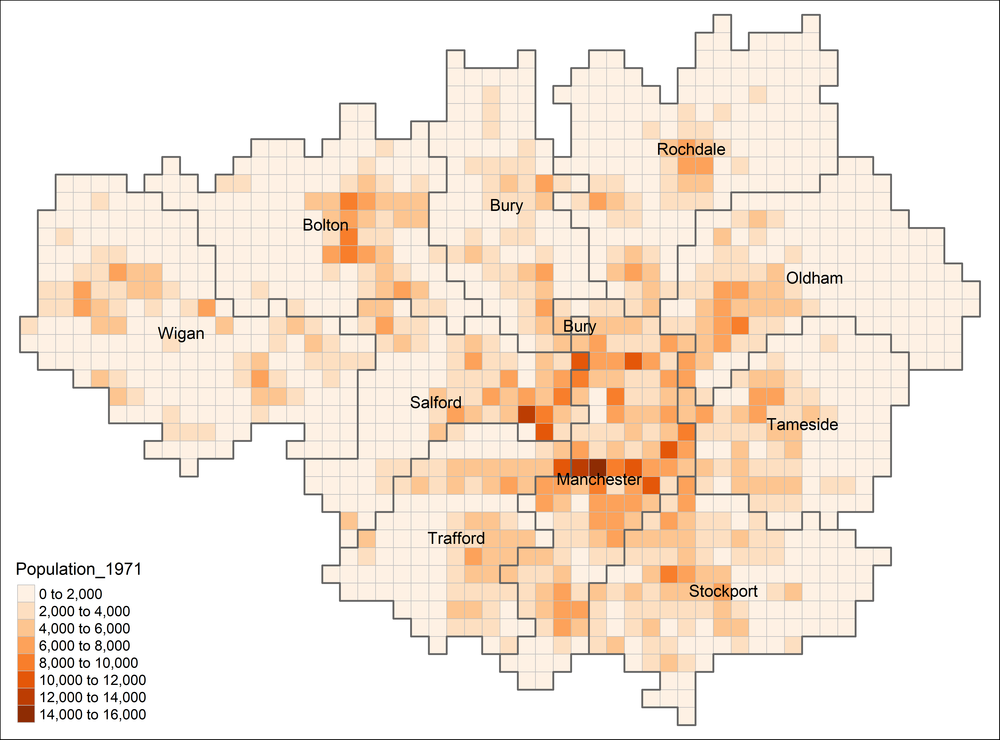

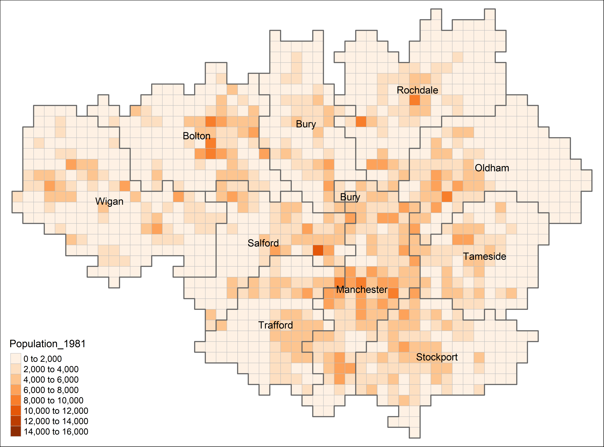

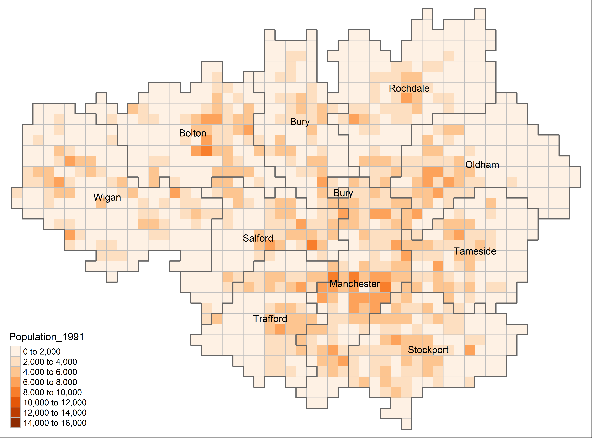


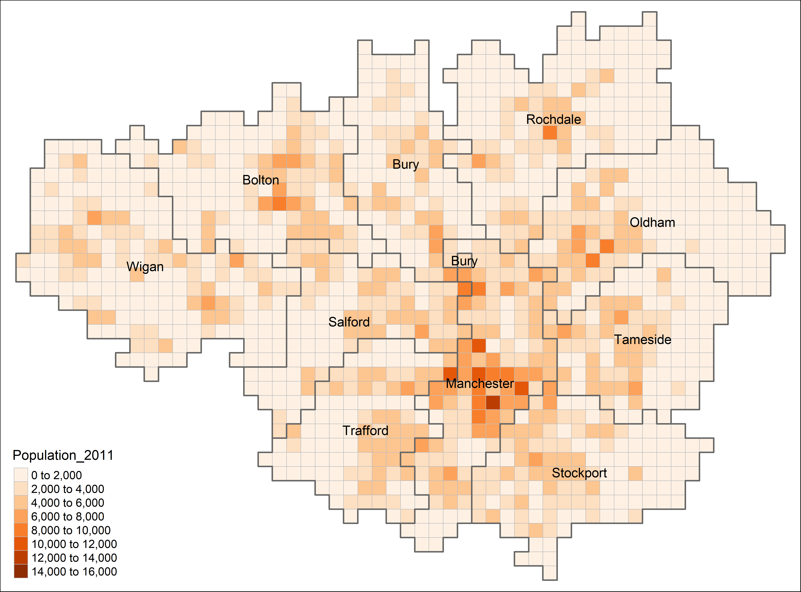

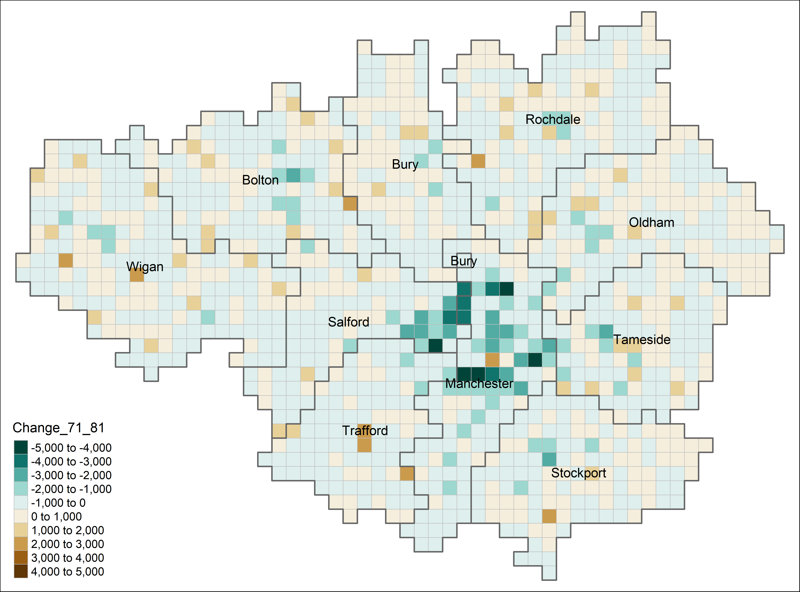

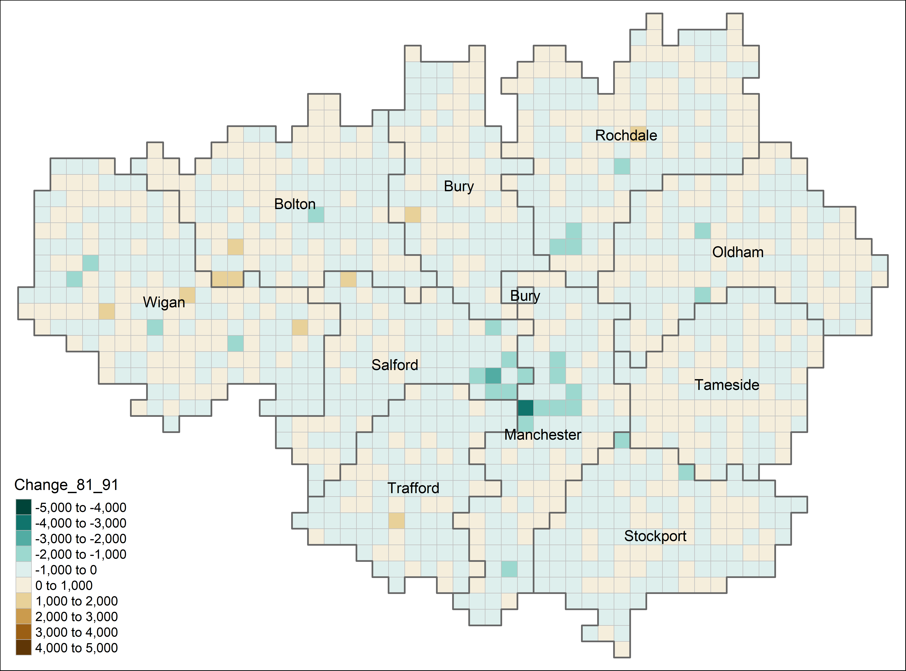

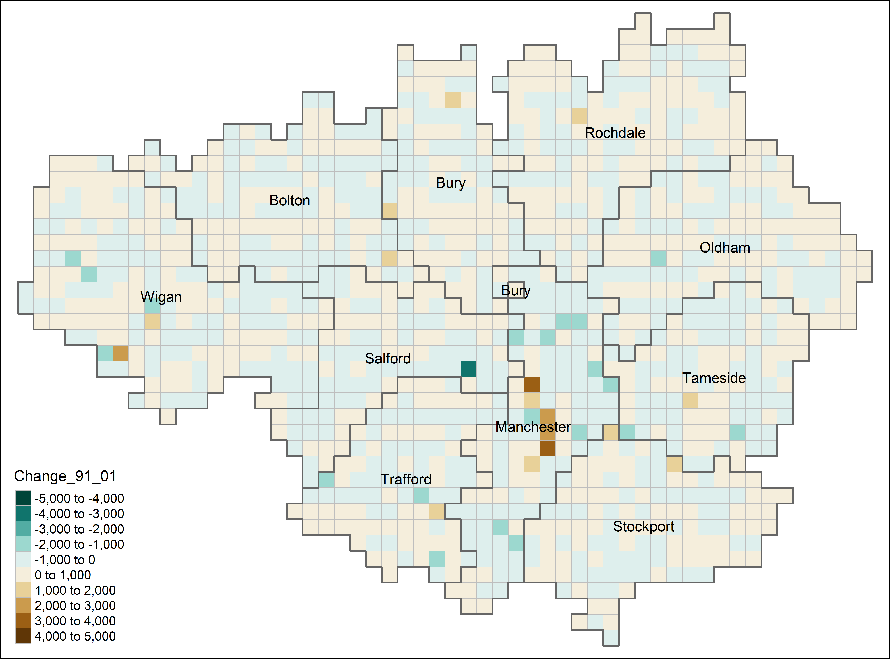

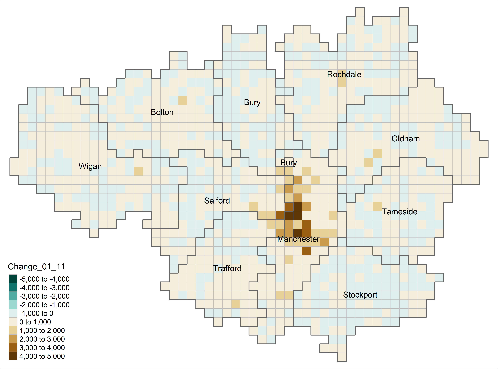

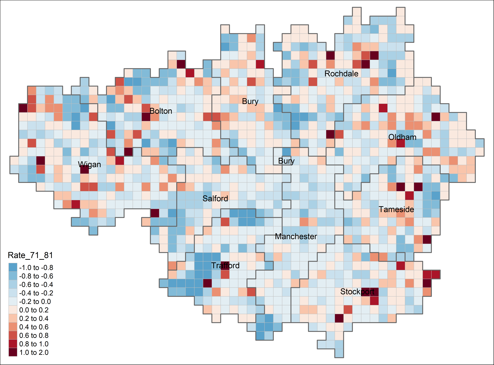

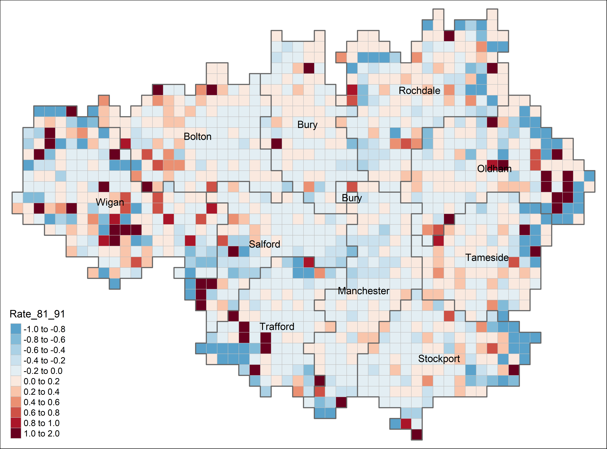

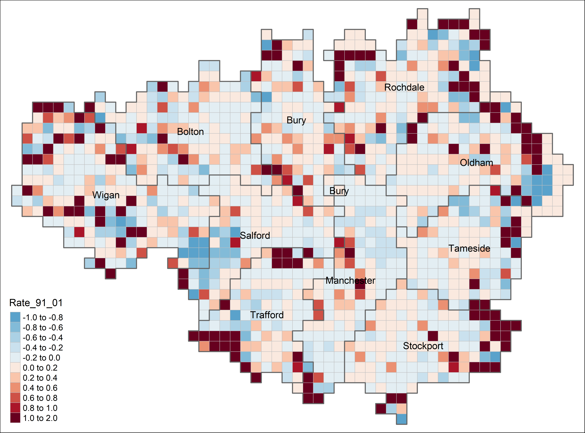

